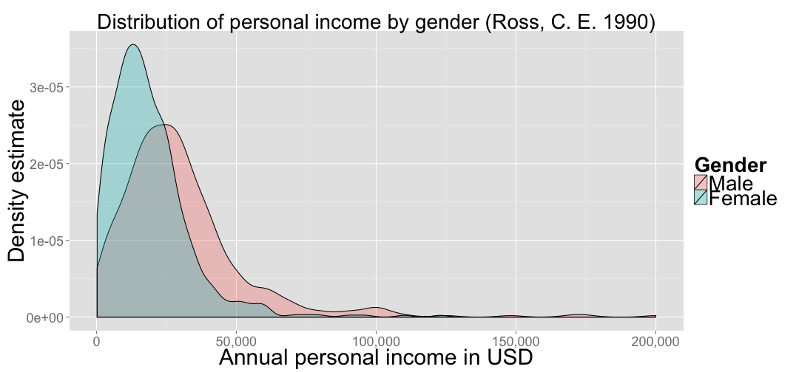
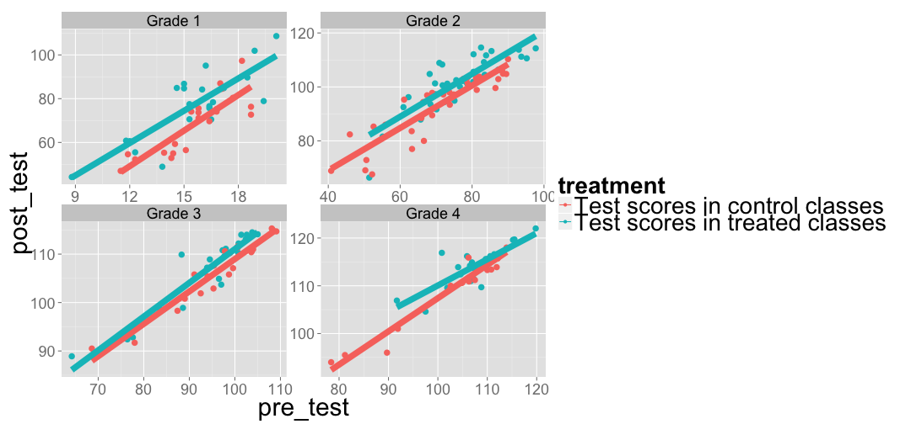

Advanced Quantitative Methods: Introduction
========================================================
author: Noe Wiener 
date: Aug 31, 2015
transition: rotate

Getting in touch
========================================================

You can reach me by email:

**wiener@newschool.edu**

I will hold my "office" hours:

*Tuesday 5-7pm*

*University Center Conference Room 308 D*

Goals
========================================================

- "Statistical literacy": data exploration, simulation, inference, regression, extensions of regression
- A set of software tools, in particular R (from data collection to publishing)
- Collaboration on a project, communication of results, reproducibility

Your Background
========================================================

- ???

Approach to the class
========================================================

- My assumption: a LOT of heterogeneity in backgrounds
- Hence, "several speeds" approach
- There is a minimum to be learned in terms of statistics and computing
- But a lot of opportunity to go further, in research project, on your own

Part of each class will be devoted to a "lab section", where you will implement what we discussed.

Assessment
========================================================

| Assignment              | Percent of Final Mark | Date             |
| ----------------------- | --------------------- | ---------------- |
| Homework 1              | 8%                    | 28 September     |
| Homework 2              | 8%                    | 19 October       |
| Homework 3              | 9%                    | 2 November       |
| Mid-term exam           | 25%                   | ca. 9 November   |
| Research project        | 50%                   | 21 December      |

Note: Some tweaking later on is possible, depending on how the class is going.

Assessment
========================================================

- Homeworks teach basic conceptual understanding, and help you *get started* with R. 
- Mid-term helps you *review* the topic of multivariate regression as a whole (as well as the topics leading up to it). Conceptual questions and R output.
- Research project lets you develop your own interests, grapple with real world data. Note: Challange is to choose a *feasible* project. The goal is not to be fancy, but careful.  Talk this over with me and in class. 

Resources
========================================================

> Diez, D. et al. (2014). Introductory Statistics with Randomization and Simulation. Available free of charge online (see syllabus).

Basic textbook. We cover most chapters. Some labs will be based on this.

> Gelman, A., Hill, J. (2007). Data Analysis Using Regression and Multilevel/Hierarchical Models. Cambridge University Press.

The more advanced textbook. We cover about the first half of the book. This book is ordered at B & N. 

> Lander, J. P. (2014). R for everyone: Advanced Analytics and Graphics. Addison-Wesley. 

For your reference.

Preview: Data visualization
========================================================


- Kernel density estimate of the distribution of labor income.

 

Preview: Regression analysis
========================================================

- Using regression to judge the effectiveness of a new teaching method

 

Preview: Multilevel modeling
========================================================

- Exploiting the information at different levels


(from Jared Lander's website: http://www.jaredlander.com/)

Troubled times for statistics
========================================================

> "The field of psychology sustained a damaging blow Thursday: A new analysis found that only 36 percent of findings from almost 100 studies in the top three psychology journals held up when the original experiments were rigorously redone. ... This attitude reflects an enormous culture change that has begun to take hold in psychology. As recently as five years ago, researchers acted largely as their own editors, shaping the story their data told. But well before the publication of the new report, a handful of researchers around the world had begun setting up systems to increase transparency and data sharing." (NYT, AUGUST 28, 2015) [http://nyti.ms/1KhnvyD](http://nyti.ms/1KhnvyD)

Reproducibility!
========================================================


***


Bayesian methods!
========================================================


***

The Monty Hall problem


Labs
========================================================

Let's get started with RStudio together

R Summary
========================================================

- R is case-sensitive


```r
x <- 5
print(X)
print(x)
```

- Functions look like this
        functionname( argument1, argument2, ... )

```r
x <- 5
mean(x)
```

```
[1] 5
```

- Arguments are always in round brackets, and separated by commas

R Summary
========================================================

- the prompt + means that the command you entered is not complete

x <- 1:

- press 'esc' if you are stuck

Getting help on any function:


```r
?sd
```

-> must be an existing R command


```r
??'histogram'
```

R Summary
========================================================

- The basic units of R are called 'objects', such as Data structures and functions.

- The most important 'container' for data is the **vector**. 

This is a vector:


```r
vector1 <- c(1,2,4,1)
vector1
```

```
[1] 1 2 4 1
```

```r
vector2 <- c(1,2,"a",4)
class(vector2)
```

```
[1] "character"
```

```r
vector2[3]
```

```
[1] "a"
```

```r
vector2[3] <- 4
class(vector2)
```

```
[1] "character"
```

```r
vector2 <- as.numeric(vector2)
```

R Summary
========================================================

**Factors** are used for categorical variables:


```r
x <- factor(c("male", "female", "female", "male"))
table(x)
```

```
x
female   male 
     2      2 
```

A **dataframe** is a way to store different tabular data (as in most statistical analysis).

```r
testdata <- data.frame(gender=x, score=vector1)
```
